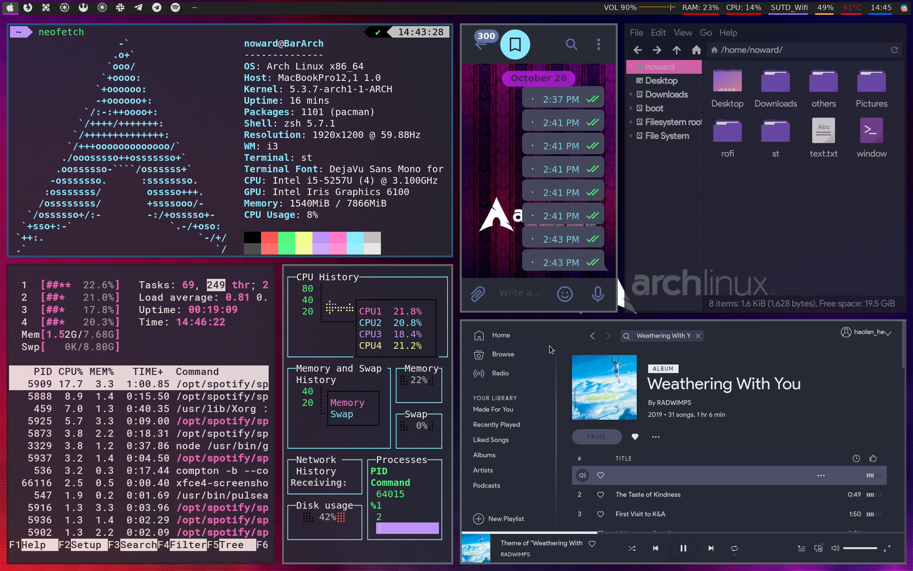

# My Arch Linux dot files
This repo stores my config files on my Arch Linux with i3-gaps and Xfce4 desktop environment.

## list of component 

- i3-gaps
- polybar with modified colorscheme and font awesome icons
- st with a few patches
- neofetch
- htop
- gtop
- telegram-desktop with Dracula theme
- Thunar with Ant-Dracula theme and Tela purple dark icon
- Spotify with Dracula theme by spicetify-cli
- zsh with archlinux git history-substring-search colored-man-pages zsh-autosuggestions zsh-completions zsh-syntax-highlighting oh-my-zsh plugins, Dracula colorscheme with powerline
- vim with 41 plugins and Dracula colorscheme 
